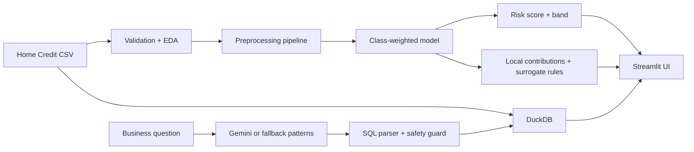

# CreditLens AI — NeoStats AI Engineer Assignment

An end-to-end, explainable credit-risk application built for the Home Credit Default Risk dataset. It covers EDA, default-probability modelling, risk bands, SHAP explanations, business-readable surrogate rules, guarded natural-language-to-SQL, a Streamlit UI, and one-command Docker deployment.

## Live Application

[Open CreditLens AI](https://creditlens-ai-neostats.streamlit.app)

## Architecture



## Why this design

- **Logistic regression** provides a strong, fast, auditable baseline and supports transparent local feature contributions.
- **Class-weighted learning + stratified split** address the imbalanced target without duplicating applicants.
- **ROC-AUC and PR-AUC** are both reported; PR-AUC is especially useful for minority-class performance.
- **DuckDB** runs analytics locally and avoids a separate database service for the evaluator.
- **Gemini is optional.** With a key, it generates SQL from broad questions. Without a key, five deterministic patterns still demonstrate the full guarded flow.
- **SQL safety** allows one `SELECT`, whitelists the `applications` table, rejects mutation keywords, and applies `LIMIT 100`.

## Dataset setup

1. Download the competition data from [Home Credit Default Risk](https://www.kaggle.com/competitions/home-credit-default-risk/data).
2. Create `data/` and copy `application_train.csv` into it.
3. Do **not** commit the dataset; `.gitignore` already excludes CSV files.

The initial implementation intentionally uses a compact group of application-level demographic, affordability, stability and external-score variables. This keeps reviewer setup fast while leaving a clear path to aggregate the bureau, previous-application and instalment tables.

## Run with Docker

```bash
cp .env.example .env
mkdir -p data artifacts
# place application_train.csv in data/
docker compose up --build
```

Open `http://localhost:8501`. The first launch trains and saves the model to `artifacts/model_bundle.joblib`.

## Run locally

```bash
python -m venv .venv
# Windows: .venv\Scripts\activate
# macOS/Linux: source .venv/bin/activate
pip install -r requirements.txt
cp .env.example .env
python train.py
streamlit run app.py
```

## Application sections

1. **Overview & EDA:** summary, missingness, distributions and five business questions.
2. **Risk prediction:** editable applicant inputs, probability, 0–1000 score and Low/Medium/High band.
3. **Explainability & rules:** local SHAP contributions and a shallow surrogate decision tree.
4. **Talk to data:** natural language → SQL → validation → DuckDB → readable result.
5. **Model performance:** ROC-AUC, PR-AUC, confusion matrix and imbalance strategy.

## Five verified talk-to-data patterns

- Overall default rate
- Default rate by gender
- Average income by risk
- Top income types
- Credit amount by education

The exact SQL is shown in the UI for auditability. Conversation memory passes only the last three turns to limit tokens and reduce irrelevant context.

## Evaluation protocol

- Fixed random seed: 42
- 80/20 stratified train/test split
- All imputation, scaling and encoding fitted only on training data through one pipeline
- Median imputation for numeric fields; most-frequent imputation for categories
- Rare-category control using `min_frequency=20`
- Class-weighted logistic regression
- Threshold-independent ROC-AUC and PR-AUC plus thresholded confusion matrix

Run `python train.py` on the supplied dataset to populate the exact metrics displayed by the app. Metrics are not hard-coded in this repository.

## Prompt and hallucination controls

The prompt includes only the table name, actual column list, target definition, three recent turns and strict output rules. Generated content is treated as untrusted: code fences are stripped, SQL is parsed into an AST, only a single `SELECT` is accepted, tables are whitelisted, mutations are blocked, and result rows are capped. Execution errors are surfaced instead of being rewritten as fabricated answers.

## Business-readable rules

A depth-3 decision-tree surrogate learns from the trained model’s predictions, then exports readable rules. These are **model-behaviour summaries**, not automatically approved lending policy. A credit-policy owner should review stability, fairness and regulatory suitability before use.

## Tests

```bash
pip install pytest
pytest -q
```

Tests cover risk-band boundaries, SQL mutation blocking and execution of a fallback analytical query.

## Known limitations and improvements

- Current baseline uses `application_train.csv`; aggregate bureau, previous-loan, POS, card and instalment history next.
- Risk-band thresholds are demonstration thresholds and need calibration to business loss and approval capacity.
- SHAP contributions are associative, not causal. Add global SHAP monitoring and reason-code governance for production.
- Assess subgroup performance, proxy discrimination, drift, calibration and reject inference before lending use.
- Add authentication, query budgets, PII masking, structured logs, model registry and monitoring for production.
- Compare tuned LightGBM/XGBoost with the interpretable baseline and retain the simpler model unless lift is material.

## Repository structure

```text
app.py                   Streamlit application
train.py                 Reproducible training entry point
src/data.py              Loading, feature selection, quality summary
src/model.py             Pipeline, metrics, scoring, explanations, rules
src/talk_to_data.py      LLM prompt, fallback patterns, SQL guard, execution
tests/test_core.py       Core safety and behaviour tests
documents/               Submission presentation (PPTX and PDF)
Dockerfile               Application image
docker-compose.yml       One-command orchestration
.env.example             Environment-variable contract
```

## Responsible-use note

This project is a decision-support prototype, not an autonomous lending system. Human review, adverse-action reason governance, fairness analysis, privacy controls and jurisdiction-specific compliance are required before real decisions.
